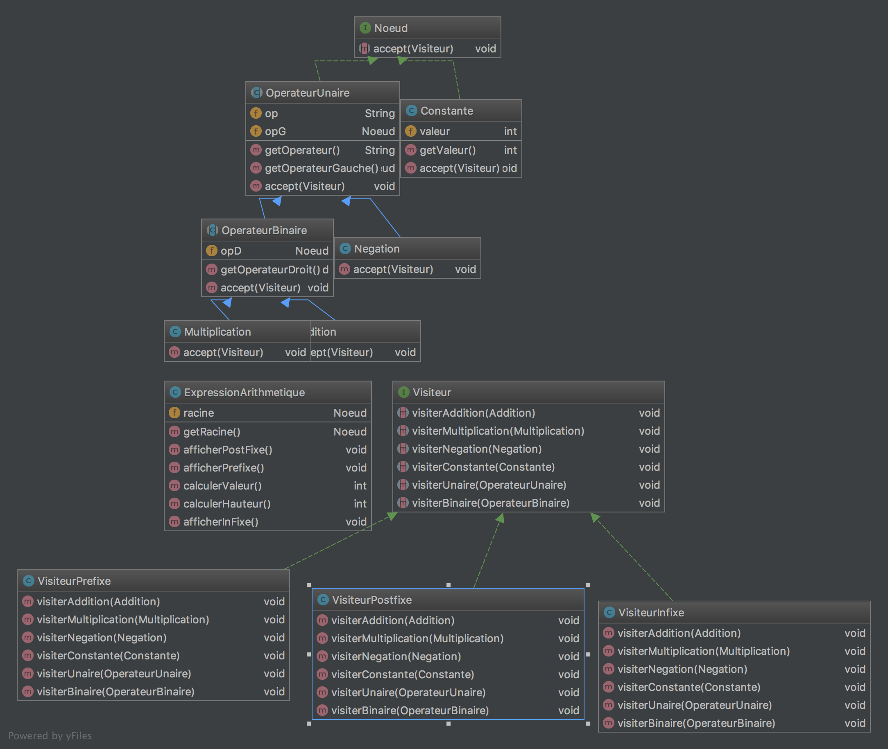

**Nom/Prénom Etudiant 1 :** DIAB Nicolas
**Nom/Prénom Etudiant 2 :** PIAT Grégoire

# Rapport TP2

## Question 1
*Insérer un schéma du patron de conception mis en place*


## Question 2
*Expliquer le code ajouté*

## Question 3
Le pattern Visitor est basé sur le principe de récursivité.

```java

public void visiterAddition(arbreBinaire.Addition addition) {
    addition.getOperateurGauche().accept(this);
    addition.getOperateurDroit().accept(this);
    System.out.print(addition.getOperateur());
}
```

Dans cette méthode du visiteur.VisiteurPostfixe, nous affichons d'abord les opérateurs autour de l'opérateur d'addition, puis nous affichons le "+". Une fois que le visiteur passera, l'affichage s'effectuera.
```java
public void visiterMultiplication(arbreBinaire.Multiplication multiplication) {

    multiplication.getOperateurGauche().accept(this);
    multiplication.getOperateurDroit().accept(this);
    System.out.print(multiplication.getOperateur());
}

public void visiterBinaire(arbreBinaire.OperateurBinaire operateurBinaire) {

    operateurBinaire.getOperateurGauche().accept(this);
    operateurBinaire.getOperateurDroit().accept(this);
    System.out.print(operateurBinaire.getOperateur());

}
```
Le fonctionnement des méthodes visiterMultiplication et visiterBinaire sont similaires à la méthode visiterAddition pour le visiteur.VisiteurPostfixe.
```java
public void visiterNegation(arbreBinaire.Negation negation) {
    negation.getOperateurGauche().accept(this);
    System.out.print(negation.getOperateur());
}

public void visiterUnaire(arbreBinaire.OperateurUnaire operateurUnaire) {

    operateurUnaire.getOperateurGauche().accept(this);
    System.out.print(operateurUnaire.getOperateur());
}
```
Pour les négations, nous affichons d'abord l'opérateur gauche avant d'afficher le signe "-".

```java
public void visiterConstante(arbreBinaire.Constante constante) {

    System.out.print(constante.getValeur());
}
```
Enfin, les constantes sont simplement affichées.

Les autres visiteurs sont disponibles ici : [visiteur.VisiteurPrefixe.java](/src/main/java/VisiteurPrefixe.java) et [visiteur.VisiteurInfixe.java](/src/main/java/VisiteurInfixe.java)


## Question 4
*Calculer la valeur d’une expression arithmétique*

Ci-dessous l'exemple du calcul pour une addition.

```java
public OptionalInt visiterAddition(Addition addition) {
        OptionalInt optionalIntGauche = addition.getOperateurGauche().accept(this);
        OptionalInt optionalIntDroit = addition.getOperateurDroit().accept(this);

        if (optionalIntGauche.isPresent() && optionalIntDroit.isPresent())
            return OptionalInt.of(optionalIntGauche.getAsInt() + optionalIntDroit.getAsInt());
        return  OptionalInt.empty();
    }
```

Comme vous pouvez le voir, tous les types de retour des visiteurs (mais aussi des accept par la même occasion) ont été changés de void à OptionalInt.
L'avantage de l'optionalInt sur un simple int permet d'éviter un return null sur des visiteurs qui ne nécessiteraient aucun retour -> comme ceux des questions précédentes.
Son plus grand défaut : l'évolutivité, si jamais on veut créer un autre visiteur qui ne retourne pas un int, mais un string par exemple.

Pour calculer une addition, on récupère la partie droite et la partie gauche de l'expression et si les deux opérateurs ont bien une valeur, on les additionne et les retourne.

Ici, grâce à la récursivité, nous n'avons pas besoin de nous occuper des priorités opératoires.

On laisse vides visiterUnaire et visiterBinaire qui ne seront jamais appelés.

## Question 5
*Calculer la hauteur de l’arbre d’une expression*

Ici, chaque méthode, sauf visiterConstante, va appeler soit visiterUnaire soit visiterBinaire qui calculera la hauteur avec une récursivité inversée.

```java
public OptionalInt visiterMultiplication(Multiplication multiplication) {
        return this.visiterBinaire(multiplication);
    }
```

On calcule la hauteur de cette manière, en ajoutant bien 1 à cheque fois :

```java
public OptionalInt visiterBinaire(OperateurBinaire operateurBinaire) {
        OptionalInt hauteurGauche = operateurBinaire.getOperateurGauche().accept(this);
        OptionalInt hauteurDroit = operateurBinaire.getOperateurDroit().accept(this);

        if (hauteurGauche.isPresent() && hauteurDroit.isPresent())
            return OptionalInt.of(Math.max(hauteurGauche.getAsInt(), hauteurDroit.getAsInt()) + 1);
        return OptionalInt.empty();
    }
```


## Question 6
*Afficher une expression en notation infixe*

On a ajouté de manière brute les parenthèses pour respecter les priorités opératoire, comme ci-dessous.

```java
public OptionalInt visiterMultiplication(Multiplication multiplication) {
        System.out.print("(");
        multiplication.getOperateurGauche().accept(this);
        System.out.print(")");

        System.out.print(multiplication.getOperateur());

        System.out.print("(");
        multiplication.getOperateurDroit().accept(this);
        System.out.print(")");
        return OptionalInt.empty();
    }
```

Cette méthode n'est pas optimale car on affiche parfois des parenthèses inutiles. Il faudrait pouvoir parcourir l'arbre avant de décider si l'on affiche, ou non, les parenthèses. Je savais pas trop comment faire ça.